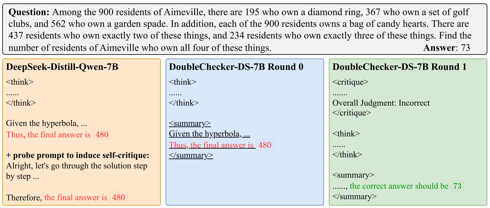

# [Double Checker: Enhancing Reasoning of Slow-Thinking LLMs via Self-Critical Fine-Tuning](https://arxiv.org/abs/2506.21285)


<p align="center">

</p>


Official PyTorch implementation of  **Double Checker**: Enhancing Reasoning of Slow-Thinking LLMs via Self-Critical Fine-Tuning


<p align="center">

</p>


[Xin Xu*](), [Tianhao Chen*](), [Fan Zhang](), [Wanlong Liu](), [Pengxiang Li](), [Ajay Kumar Jaiswal](), [Yuchen Yan](), [Jishan Hu](), [Yang Wang](), [Hao Chen](), [Shiwei Liu](https://shiweiliuiiiiiii.github.io/), [Shizhe Diao](), [Can Yang†](https://sites.google.com/site/eeyangc/), [Lu Yin†](https://luuyin.com//) * Equal contribution.
† Corresponding author.


**The Hong Kong University of Science and Technology, University of Electronic Science and Technology of China, Dalian University of Technology, University of Texas at Austin, Zhejiang University, University of Oxford, NVIDIA, University of Surrey.**


## Table of contents

* [Abstract](#abstract)


* [Results](#Results)

* [Installation](#installation)
* [Usage](#Usage)


## Abstract
--- 
While slow-thinking large language models (LLMs) exhibit reflection-like reasoning, commonly referred to as the “aha moment”, their ability to generate informative critiques and refine prior solutions remains limited. In this paper, we introduce **Double-Checker**, a principled framework designed to enhance the reasoning capabilities of slow-thinking LLMs by fostering explicit self-critique and iterative refinement of their previous solutions. By fine-tuning on our curated **1,730 self-critical instances**, Double-Checker empowers long-CoT LLMs to iteratively critique and refine their outputs during inference until they evaluate their solutions as correct under self-generated critiques. We validate the efficacy of Double-Checker across a comprehensive suite of reasoning benchmarks, demonstrating that iterative self-critique significantly enhances the reasoning capabilities of long-CoT LLMs. Notably, our Double-Checker increases the pass@1 performance on challenging **AIME benchmarks from 4.4% to 18.2%** compared to the original long-CoT LLMs. These results highlight a promising direction for developing more trustworthy and effective LLMs capable of structured self-critique.


## Results 
--- 

<p align="center">

</p>


## Installation
--- 

First, install torch 2.6.0 + cuda12.4 and vllm=0.8.5.post1
```bash
pip install torch==2.6.0 torchvision==0.21.0 torchaudio==2.6.0 --index-url https://download.pytorch.org/whl/cu124
pip install vllm==0.8.5.post1
```

Then, install llama_factorcy:

```bash
git clone https://github.com/XinXU-USTC/DoubleChecker.git
cd DoubleChecker/train/LLaMA-Factory/
pip install -e .
```

## Usage
--- 
### Training

To train DeepSeek-Distill-7B model, please first revise ```train/LLaMA-Factory//scripts/double-checker-ds-qwen7b.yaml``` accordingly and then run the following command:
```bash
llamafactory-cli train ../scripts/double-checker-ds-qwen7b.yaml
```

### Benchmark Evaluation

#### Data Preparation

All benchmark datasets for evaluation should be placed in the `./data` directory.

To add a new test dataset, follow the format of existing benchmarks in the `./data` directory.

#### Prompt Configuration

For mathematical problems, we use the Qwen-instruct template:

```python
system_prompt = "Please reason step by step, and put your final answer within \\boxed{}."

few_shot_prompt = ""

question_format = """{question}"""
```

When adding a new mathematics benchmark, you can directly copy the above content to the corresponding `./prompts/qwen-instruct/xxx.py` file.


#### Running Evaluation
You can run evaluation on "math" dataset using "qwen-instruct" prompt with greedy decoding, 32K max tokens, and 1 round of critique using four GPUs using the following command:

```bash
CUDA_VISIBLE_DEVICES='0,1,2,3' \
python eval.py \
--model_name_or_path "/path/to/model/weights" \  # Path to model weights
--data_name "math" \  # Benchmark name (corresponding to first-level directory in ./data)
--prompt_type "qwen-instruct" \  # Default chat template
--temperature 0.0 \  # Sampling temperature
--start_idx 0 \  # Starting index for evaluation data
--end_idx -1 \  # Ending index for evaluation data
--n_sampling 1 \  # Number of samples per question
--k 1 \  # k value for unbiased pass@k calculation
--split "test" \  # Benchmark subset partition
--max_tokens 32768 \  # Maximum output length
--seed 0 \  # Random seed
--top_p 1 \  # Top-p sampling parameter
--surround_with_messages \  # Enable this flag if using chat template
--num_rounds 1 # number of rounds to self-critique
```

## Acknowledgments

Our evaluation code is modified from [Qwen2.5-Math](https://github.com/QwenLM/Qwen2.5-Math/tree/main/evaluation). We thank their team for their valuable contributions to the community.

## Citation
if you find this repo is helpful, please cite

```
@article{xu2025double,
  title={Double-Checker: Enhancing Reasoning of Slow-Thinking LLMs via Self-Critical Fine-Tuning},
  author={Xu, Xin and Chen, Tianhao and Zhang, Fan and Liu, Wanlong and Li, Pengxiang and Jaiswal, Ajay Kumar and Yan, Yuchen and Hu, Jishan and Wang, Yang and Chen, Hao and others},
  journal={arXiv preprint arXiv:2506.21285},
  year={2025}
}
```
